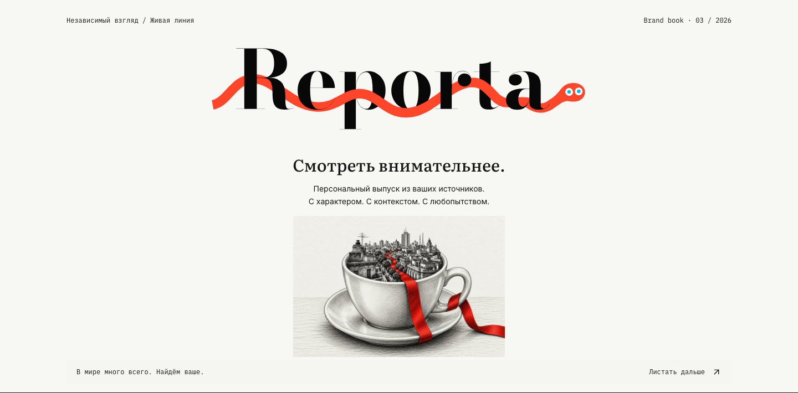

# Reporta

<p align="center">
  <a href="https://news.tomko.io/brand/"></a>
</p>

<p align="center">
  Персональная новостная лента, которая пробирается через шум и оставляет сигнал.
  <br>
  <a href="https://news.tomko.io/brand/">Открыть интерактивный брендбук</a> ·
  <a href="https://news.tomko.io/brand/reporta-brand-kit.zip">Скачать бренд-кит</a>
</p>

Reporta собирает поток, оценивает каждый материал по общим осям, отбирает
лучшее под конкретного читателя и пишет дайджест его языком. Красная линия —
это не декоративный элемент: это маленький редактор, который пробирается через
текст и находит то, что стоит открыть.

### Brand assets

<p align="center">
  
  
  
</p>

Brand system v3: настоящие векторные логотип и знак, гравюры с простыми
сюрреалистическими метафорами, семантические цвета интерфейса в двух темах,
правила композиции, типографика, пример выпуска, движение, цветовые версии,
четыре интерактивных состояния продукта и фотография в трёх форматах.
Примеры в брендбуке не изменяют аккаунт и не являются реальными новостями.

- `public/brand/logo-reporta.svg` — векторный логотип, Bodoni Moda 700 в контурах
- `public/brand/logo-reporta-approved-transparent.png` — прозрачная PNG-версия для макетов
- `public/brand/logo-reporta-dark.svg` — прозрачная версия для тёмных поверхностей
- `public/brand/mark-reporta.svg` / `public/brand/mark-reporta.png` — самостоятельный знак-змейка
- `public/brand/favicon.svg` — favicon и аватар
- `public/brand/index.html` — все 10 направлений и интерактивные примеры
- `public/brand/GUIDELINES.md` — правила использования
- `public/brand/tokens.css` — готовые CSS-токены
- `public/brand/reporta-brand-kit.zip` — полный набор с локальными шрифтами

Логотип: **Bodoni Moda 700**, кернинг шрифта, буквы переведены в кривые.
Типографика: **Fraunces / Literata** для заголовков (латиница / кириллица),
**Inter** для текста и интерфейса, **DM Mono / IBM Plex Mono** для метаданных.
Шрифты, изображения и скрипты локальные: `public/brand/index.html` работает
с диска без сервера. [Происхождение ассетов](./public/brand/ASSETS.md).
SVG логотипа и знака содержат только векторную геометрию, без встроенного растра.

Новостная лента на многих читателей: собирает весь поток, оценивает каждый
материал по осям, отбирает кодом под каждого читателя, пишет ему дайджест
его языком и присылает ссылку в его чат. Подключена читалка — выпуск уходит
книгой на Kindle. Читается в вебе — там же собирается статистика, по которой
отбор калибруется, и там же ищется то, что уже приходило: «где я видел
про uranium и дата-центры» отвечает архив, а не память.

Читатель заводится сам: пишет боту `/start`, подписывается на канал и
получает одноразовую ссылку на сайт. Дальше три шага — интересы, источники,
первый выпуск, — и он собирается сразу, из уже оценённого потока. Сбор
и оценка идут один раз на всех, они не зависят от того, кто читает,
а отбор, текст и статистика персональны.

## Как устроен отбор

Четыре каскада, и дорогая модель работает только на последнем:

| | что происходит | чем |
|---|---|---|
| 1 | сбор всего потока без фильтрации, сотни материалов | RSS, Hacker News, Reddit, X |
| 2 | восемь типизированных вопросов на каждый материал | [Jev](https://docs.typesafe.ai) |
| 3 | скор весами читателя, круг по его темам | код, `pipeline/select.ts` |
| 4 | дайджест из выживших, языком читателя | любой OpenAI-совместимый провайдер |

Второй каскад стоит около $0.003 в день на триста материалов — настолько
дёшево, что прогоняется весь поток, а не выборка. Четвёртый видит
пятнадцать материалов вместо трёхсот.

### Восемь осей

Не «важность вообще», а различения, по которым решаешь — открыть или пролистать:

- **тема** — выбор из общего справочника `topics`, плюс «прочее»
- **тип** — факт, прогноз, мнение, анонс, перепечатка
- **новизна** — событие или пережёвывание известного
- **конкретика** — цифры, названный источник, первичные данные
- **горизонт** — шум дня, месяцы, годы
- **actionability** — требует ли действия сейчас
- **кликбейт** — обещает ли заголовок больше, чем даёт текст
- **самодостаточность** — есть ли за материалом работа

Веса живут в `dailynews.readers.weights` — у каждого свои — и меняются без
правки кода. Скор материала поэтому персонален: он считается из общих `axes`
весами читателя и ложится снимком в `digest_items.total`.
Дедупликация осями не занимается: она в `pipeline/dedup.ts` — канонический
адрес плюс нечёткое сравнение заголовков через `pg_trgm`.

### Калибровка

Каждое открытие карточки пишется в `dailynews.reads` со снимком скора и
уверенности на тот момент. Страница `/calibration` показывает, растёт ли
доля открытий с ростом скора. Если не растёт — отбор угадывает. Если высокая
уверенность не совпадает с открытиями, неверно подобраны сами оси.

Поэтому же в Telegram уходит только уведомление без ссылок на источники:
там пролистывание неотличимо от чтения.

## Установка

### 1. База

Проект Supabase `brasil-products`, схема `dailynews`. Миграции накатывает
`npm run migrate` владельческой строкой из `SUPABASE_DB_URL` (роль `postgres`):
роль приложения намеренно не владелец таблиц, и DDL ей запрещён. Файлы
применяются по порядку имён:

```
db/migrations/0001_schema_and_role.sql
db/migrations/0002_tables.sql
db/migrations/0003_seed.sql
...
db/migrations/0020_readers.sql
```

Применяются все файлы каталога по порядку имён — так же, как их прогоняет
`npm run verify:db`.

После первой миграции — поставить пароль роли `dailynews_bot` и проверить,
что схема `dailynews` **не отмечена** в Exposed schemas: она появляется там
невыбранной, в одном клике от публичности.

### 2. Ключи

Скопировать `.env.example` в `.env` и заполнить. Обязательные —
`DATABASE_URL`, `TYPESAFE_API_KEY`, `APP_PASSWORD`, `APP_SECRET`,
`TELEGRAM_BOT_TOKEN` и `TELEGRAM_WEBHOOK_SECRET`: без последних двух
читатель не может ни завестись, ни войти.

`DATABASE_URL` — строка **пулера**, не прямого хоста: у `db.<ref>.supabase.co`
только IPv6, и ни Vercel, ни раннеры GitHub по нему не ходят. Симптом при
ошибке выглядит как неверный пароль, а не как отсутствие маршрута.

Reddit бесплатен, но требует ключей: [reddit.com/prefs/apps](https://www.reddit.com/prefs/apps),
тип `script`. Без них анонимные запросы получают 429 уже на втором сабреддите —
это проверено, увеличение пауз не помогает.

X платный, около $0.15 за 1000 постов. Без `X_API_KEY` источники этого типа
просто показывают ошибку в настройках.

### 3. Запуск

```bash
npm install
npm run dev         # интерфейс
npm run pipeline    # прогон вручную
npm test            # канонизация, нормализация, формула скора
npm run verify:db   # схема и все запросы на Postgres в процессе (PGlite)
npm run dry-run     # настоящий сбор и дедуп, без Jev и без общей базы
npm run ping        # живое подключение: роль, читатели, их темы, источники
npm run env:set KEY # вписать ключ в .env, не открывая файл редактором
npm run bot:webhook # поставить вебхук бота и проверить, что он стоит
```

`bot:webhook` запускается после первого развёртывания и после любой смены
домена или секрета. Незаданный вебхук — самый тихий отказ из возможных:
сайт открывается, прогон идёт, выпуски приходят, и только `/start` остаётся
без ответа, о чём никто не узнает, пока не напишет боту сам.

`env:set` появился не от хорошей жизни: редактор держит копию файла и при
сохранении возвращает её целиком — один раз так потерялась строка подключения.

`dry-run` отвечает на вопрос, который локальными тестами не закрыть: живы
ли источники каталога и сколько они дают на самом деле. Ключ Jev не тратит,
в Telegram ничего не шлёт, в общую базу не пишет.

`verify:db` поднимает настоящий Postgres внутри процесса, применяет
миграции 0002 и 0003, заполняет их выдуманными данными и прогоняет все
запросы приложения. Гранты и роли из 0001 он не покрывает: их в PGlite
нет, и по инфра-документу их положено читать из каталога живого инстанса.
Запускать перед любым изменением схемы — общая база не место для проверки DDL.

Ежедневный прогон — `.github/workflows/digest.yml`, 07:00 BRT.
Интерфейс: **https://dailynews-pi.vercel.app** (Vercel, проект `dailynews`).

Веб-приложению нужны `DATABASE_URL`, `APP_SECRET`, `APP_PASSWORD`,
`TELEGRAM_BOT_TOKEN` и `TELEGRAM_WEBHOOK_SECRET`: вебхук бота живёт в том же
контейнере. Там же второй бот — `POSTBOT_TOKEN`, `POSTBOT_WEBHOOK_SECRET`
и `TELEGRAM_CHAT_ID`, номер владельца, единственного, кому он отвечает. Ключи моделей и источников читает один пайплайн.

Вход — подписанная кука, без Supabase Auth: продуктовые схемы не
экспонируются в PostgREST, поэтому клиентской сессии Supabase не с чем
работать. Номер читателя лежит **внутри** подписываемой строки, а не рядом
с подписью: иначе своя кука с подменённым номером открывала бы чужую ленту.
Файл `src/middleware.ts` обязан лежать именно в `src/` — в корне
Next его не ищет, и страницы отдаются без входа молча.

## Что где

```
pipeline/
  run.ts            оркестратор: сбор и оценка на всех, дальше цикл по читателям
  fetch.ts          адаптеры источников, ограничение по хосту и свежести
  normalize.ts      канонический адрес и нормализованный заголовок
  dedup.ts          пометка дублей через pg_trgm
  score.ts          восемь вопросов Jev и формула составного скора
  select.ts         кандидаты читателя и взвешенный круг по его темам
  interests.ts      один вопрос Jev: какие интересы ближе по описанию в Telegram
  digest.ts         письмо дайджеста по выжившим
  kindle.ts         выпуск книгой через Resend, свой отправитель на читателя
  cost.ts           цена вызова модели для дневного потолка
  check-sources.ts  проверка фида живым запросом
  dry-run.ts        сбор и дедуп на живых источниках, база в процессе
src/lib/
  readers.ts        читатели, их темы, их источники, счёт расходов
  starter-topics.ts готовые интересы и первые источники под каждый
  onboarding.ts     шаг первого захода и подборка источников под интересы
  telegram.ts       разбор апдейта, секрет вебхука, отправка
  search.ts         разбор поискового запроса, словарь языка, подсветка
  session.ts        кто сейчас читает — только из подписанной куки
src/app/            интерфейс: лента, интересы, источники, доставка, калибровка
src/app/(app)/search  поиск по прошлым выпускам этого читателя
src/app/(app)/welcome первый заход: интересы → источники → первый выпуск
src/app/api/telegram  вебхук бота: /start заводит читателя и шлёт ссылку
db/migrations/      схема, роль, таблицы, стартовый каталог
db/verify.ts        прогон схемы и запросов на Postgres в процессе
legacy/             прежний генератор HTML-журналов
```

Архив из 314 выпусков остался в `magazines/`, прежние воркфлоу сняты с
расписания, но запускаются вручную.
